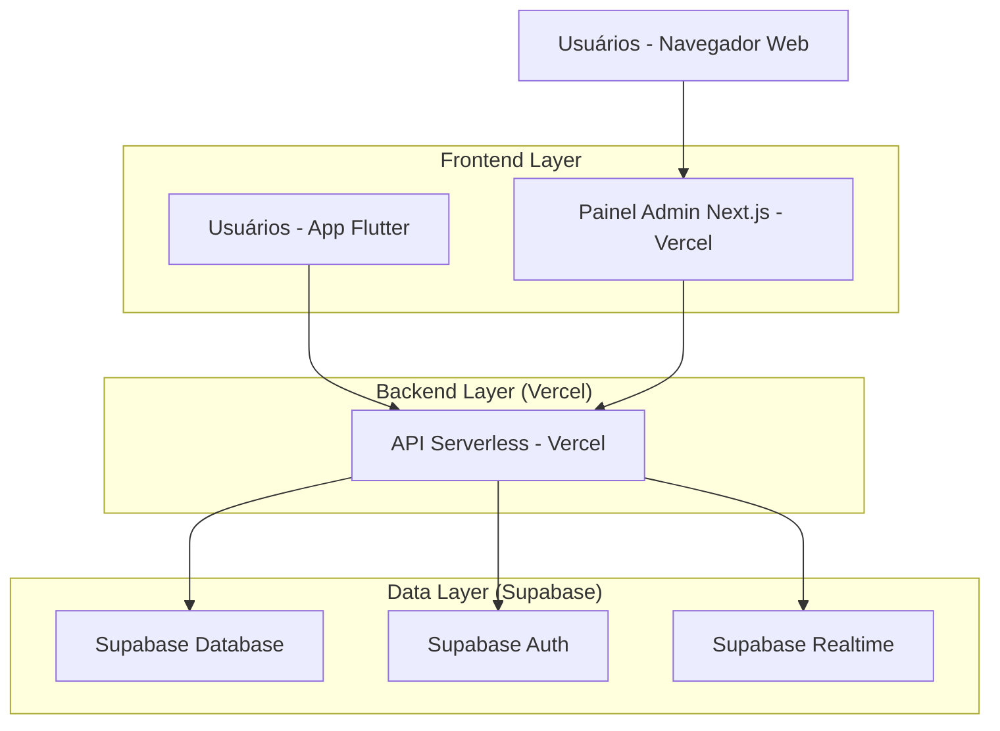
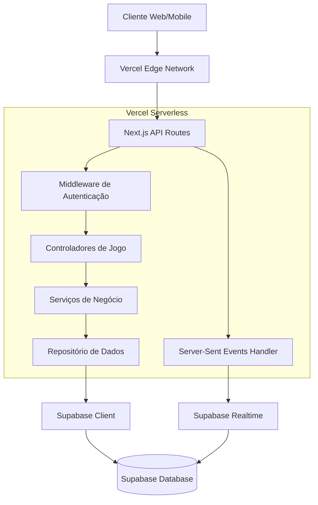
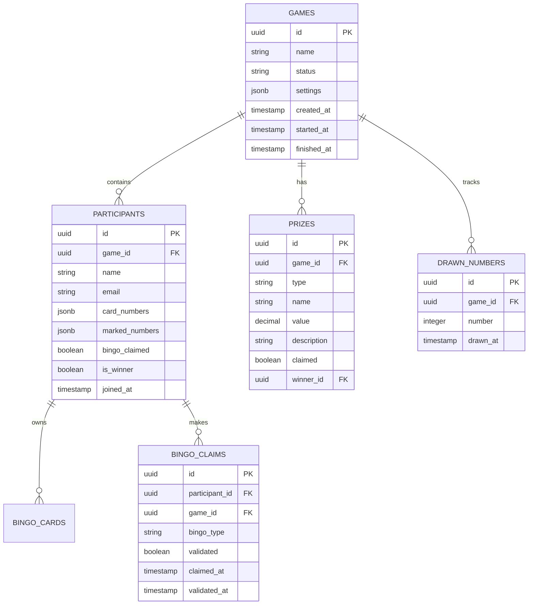

# Arquitetura Técnica - Sistema Bingo Web Admin

## 1. Design da Arquitetura



## 2. Descrição das Tecnologias

* **Frontend Web**: Next.js\@14 + TypeScript + Tailwind CSS + Shadcn/ui

* **Frontend Mobile**: Flutter + Supabase Client SDK

* **Backend**: Vercel Serverless Functions + Next.js API Routes

* **Database**: Supabase (PostgreSQL)

* **Autenticação**: Supabase Auth

* **Tempo Real**: Supabase Realtime + Server-Sent Events

## 3. Definições de Rotas

### 3.1 Rotas do Painel Web (Next.js)

| Rota                | Propósito                                        |
| ------------------- | ------------------------------------------------ |
| /admin              | Página de login do administrador                 |
| /admin/dashboard    | Dashboard principal com estatísticas e controles |
| /admin/game/\[id]   | Controle específico de jogo ativo                |
| /admin/prizes       | Configuração de prêmios e regras                 |
| /admin/history      | Histórico de jogos e relatórios                  |
| /admin/participants | Gerenciamento de participantes                   |

### 3.2 Rotas do App Flutter

| Rota        | Propósito                                    |
| ----------- | -------------------------------------------- |
| /login      | Tela de login e registro de participantes    |
| /lobby      | Lista de jogos disponíveis para participar   |
| /game/\[id] | Tela principal do jogo com cartela de bingo  |
| /profile    | Perfil do usuário e configurações            |
| /history    | Histórico de jogos e prêmios do participante |

## 4. Definições de API

### 4.1 API Principal

**Autenticação de Administrador**

```
POST /api/admin/auth/login
```

Request:

| Nome do Parâmetro | Tipo   | Obrigatório | Descrição              |
| ----------------- | ------ | ----------- | ---------------------- |
| email             | string | true        | Email do administrador |
| password          | string | true        | Senha do administrador |

Response:

| Nome do Parâmetro | Tipo    | Descrição              |
| ----------------- | ------- | ---------------------- |
| success           | boolean | Status da autenticação |
| token             | string  | JWT token para sessão  |
| user              | object  | Dados do administrador |

**Gerenciamento de Jogos**

```
POST /api/games
GET /api/games
PUT /api/games/[id]
DELETE /api/games/[id]
```

**Sorteio de Números**

```
POST /api/games/[id]/draw
```

Request:

| Nome do Parâmetro | Tipo   | Obrigatório | Descrição        |
| ----------------- | ------ | ----------- | ---------------- |
| gameId            | string | true        | ID do jogo ativo |

Response:

| Nome do Parâmetro | Tipo   | Descrição                     |
| ----------------- | ------ | ----------------------------- |
| number            | number | Número sorteado               |
| drawnNumbers      | array  | Lista de números já sorteados |
| timestamp         | string | Momento do sorteio            |

**Validação de Bingo**

```
POST /api/games/[id]/validate-bingo
```

Request:

| Nome do Parâmetro | Tipo   | Obrigatório | Descrição                            |
| ----------------- | ------ | ----------- | ------------------------------------ |
| userId            | string | true        | ID do participante                   |
| cardNumbers       | array  | true        | Números da cartela marcados          |
| bingoType         | string | true        | Tipo de bingo (linha/coluna/cartela) |

**Tempo Real (Server-Sent Events)**

```
GET /api/games/[id]/events
```

Eventos enviados:

* `number-drawn`: Novo número sorteado

* `bingo-claimed`: Participante declarou bingo

* `bingo-validated`: Bingo validado pelo admin

* `game-ended`: Jogo finalizado

* `participant-joined`: Novo participante entrou

### 4.2 Tipos TypeScript Compartilhados

```typescript
interface Game {
  id: string;
  name: string;
  status: 'waiting' | 'active' | 'finished';
  drawnNumbers: number[];
  participants: Participant[];
  prizes: Prize[];
  createdAt: string;
  startedAt?: string;
  finishedAt?: string;
}

interface Participant {
  id: string;
  name: string;
  email: string;
  card: number[][];
  markedNumbers: number[];
  bingoClaimed: boolean;
  isWinner: boolean;
  joinedAt: string;
}

interface Prize {
  id: string;
  type: 'line' | 'column' | 'full-card';
  name: string;
  value: number;
  description: string;
  claimed: boolean;
  winnerId?: string;
}

interface BingoEvent {
  type: 'number-drawn' | 'bingo-claimed' | 'bingo-validated' | 'game-ended' | 'participant-joined';
  gameId: string;
  data: any;
  timestamp: string;
}
```

## 5. Arquitetura do Servidor



## 6. Modelo de Dados

### 6.1 Definição do Modelo de Dados



### 6.2 Linguagem de Definição de Dados (DDL)

**Tabela de Jogos (games)**

```sql
-- Criar tabela de jogos
CREATE TABLE games (
    id UUID PRIMARY KEY DEFAULT gen_random_uuid(),
    name VARCHAR(255) NOT NULL,
    status VARCHAR(20) DEFAULT 'waiting' CHECK (status IN ('waiting', 'active', 'finished')),
    settings JSONB DEFAULT '{}',
    created_at TIMESTAMP WITH TIME ZONE DEFAULT NOW(),
    started_at TIMESTAMP WITH TIME ZONE,
    finished_at TIMESTAMP WITH TIME ZONE
);

-- Criar índices
CREATE INDEX idx_games_status ON games(status);
CREATE INDEX idx_games_created_at ON games(created_at DESC);

-- Políticas RLS (Row Level Security)
ALTER TABLE games ENABLE ROW LEVEL SECURITY;
GRANT SELECT ON games TO anon;
GRANT ALL PRIVILEGES ON games TO authenticated;
```

**Tabela de Participantes (participants)**

```sql
-- Criar tabela de participantes
CREATE TABLE participants (
    id UUID PRIMARY KEY DEFAULT gen_random_uuid(),
    game_id UUID REFERENCES games(id) ON DELETE CASCADE,
    name VARCHAR(255) NOT NULL,
    email VARCHAR(255) NOT NULL,
    card_numbers JSONB NOT NULL,
    marked_numbers JSONB DEFAULT '[]',
    bingo_claimed BOOLEAN DEFAULT FALSE,
    is_winner BOOLEAN DEFAULT FALSE,
    joined_at TIMESTAMP WITH TIME ZONE DEFAULT NOW()
);

-- Criar índices
CREATE INDEX idx_participants_game_id ON participants(game_id);
CREATE INDEX idx_participants_email ON participants(email);
CREATE INDEX idx_participants_joined_at ON participants(joined_at DESC);

-- Políticas RLS
ALTER TABLE participants ENABLE ROW LEVEL SECURITY;
GRANT SELECT ON participants TO anon;
GRANT ALL PRIVILEGES ON participants TO authenticated;
```

**Tabela de Prêmios (prizes)**

```sql
-- Criar tabela de prêmios
CREATE TABLE prizes (
    id UUID PRIMARY KEY DEFAULT gen_random_uuid(),
    game_id UUID REFERENCES games(id) ON DELETE CASCADE,
    type VARCHAR(20) NOT NULL CHECK (type IN ('line', 'column', 'full-card')),
    name VARCHAR(255) NOT NULL,
    value DECIMAL(10,2) DEFAULT 0,
    description TEXT,
    claimed BOOLEAN DEFAULT FALSE,
    winner_id UUID REFERENCES participants(id)
);

-- Criar índices
CREATE INDEX idx_prizes_game_id ON prizes(game_id);
CREATE INDEX idx_prizes_type ON prizes(type);

-- Políticas RLS
ALTER TABLE prizes ENABLE ROW LEVEL SECURITY;
GRANT SELECT ON prizes TO anon;
GRANT ALL PRIVILEGES ON prizes TO authenticated;
```

**Tabela de Números Sorteados (drawn\_numbers)**

```sql
-- Criar tabela de números sorteados
CREATE TABLE drawn_numbers (
    id UUID PRIMARY KEY DEFAULT gen_random_uuid(),
    game_id UUID REFERENCES games(id) ON DELETE CASCADE,
    number INTEGER NOT NULL CHECK (number >= 1 AND number <= 75),
    drawn_at TIMESTAMP WITH TIME ZONE DEFAULT NOW()
);

-- Criar índices
CREATE INDEX idx_drawn_numbers_game_id ON drawn_numbers(game_id);
CREATE INDEX idx_drawn_numbers_drawn_at ON drawn_numbers(drawn_at DESC);
CREATE UNIQUE INDEX idx_drawn_numbers_game_number ON drawn_numbers(game_id, number);

-- Políticas RLS
ALTER TABLE drawn_numbers ENABLE ROW LEVEL SECURITY;
GRANT SELECT ON drawn_numbers TO anon;
GRANT ALL PRIVILEGES ON drawn_numbers TO authenticated;
```

**Tabela de Declarações de Bingo (bingo\_claims)**

```sql
-- Criar tabela de declarações de bingo
CREATE TABLE bingo_claims (
    id UUID PRIMARY KEY DEFAULT gen_random_uuid(),
    participant_id UUID REFERENCES participants(id) ON DELETE CASCADE,
    game_id UUID REFERENCES games(id) ON DELETE CASCADE,
    bingo_type VARCHAR(20) NOT NULL CHECK (bingo_type IN ('line', 'column', 'full-card')),
    validated BOOLEAN DEFAULT FALSE,
    claimed_at TIMESTAMP WITH TIME ZONE DEFAULT NOW(),
    validated_at TIMESTAMP WITH TIME ZONE
);

-- Criar índices
CREATE INDEX idx_bingo_claims_participant_id ON bingo_claims(participant_id);
CREATE INDEX idx_bingo_claims_game_id ON bingo_claims(game_id);
CREATE INDEX idx_bingo_claims_claimed_at ON bingo_claims(claimed_at DESC);

-- Políticas RLS
ALTER TABLE bingo_claims ENABLE ROW LEVEL SECURITY;
GRANT SELECT ON bingo_claims TO anon;
GRANT ALL PRIVILEGES ON bingo_claims TO authenticated;
```

**Dados Iniciais**

```sql
-- Inserir jogo de exemplo
INSERT INTO games (name, status, settings) VALUES 
('Bingo de Teste', 'waiting', '{"maxParticipants": 50, "autoValidate": false}');

-- Inserir prêmios padrão
INSERT INTO prizes (game_id, type, name, value, description) 
SELECT 
    (SELECT id FROM games WHERE name = 'Bingo de Teste'),
    unnest(ARRAY['line', 'column', 'full-card']),
    unnest(ARRAY['Primeira Linha', 'Primeira Coluna', 'Cartela Cheia']),
    unnest(ARRAY[100.00, 200.00, 500.00]),
    unnest(ARRAY['Prêmio para primeira linha completa', 'Prêmio para primeira coluna completa', 'Prêmio para cartela completa']);
```

