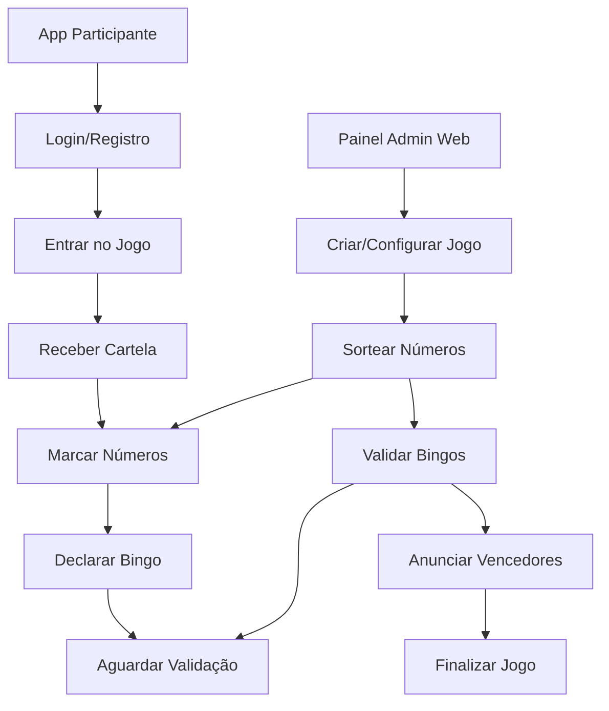

# Sistema Bingo - Painel Admin Web (Vercel)

## 1. Visão Geral do Produto

Sistema de Bingo com painel administrativo web hospedado na Vercel e aplicativo Flutter para participantes. O sistema permite gerenciamento completo de jogos de bingo através de uma interface web moderna, enquanto os participantes usam o app móvel para jogar em tempo real.

- **Objetivo**: Migrar funcionalidades administrativas do app Flutter para um painel web profissional na Vercel, mantendo apenas recursos de participante no app móvel.
- **Valor de mercado**: Solução escalável e confiável para eventos de bingo, permitindo administração remota e participação móvel simultânea.

## 2. Funcionalidades Principais

### 2.1 Papéis de Usuário

| Papel | Método de Registro | Permissões Principais |
|-------|-------------------|----------------------|
| Administrador | Login com credenciais específicas no painel web | Gerenciar jogos, sortear números, definir prêmios, resetar partidas |
| Participante | Registro por email no app móvel | Participar de jogos, marcar números, visualizar sorteios |

### 2.2 Módulos de Funcionalidade

Nosso sistema de Bingo consiste nas seguintes páginas principais:

1. **Painel Admin Web (Vercel)**: controle de jogos, sorteio de números, configuração de prêmios, visualização de participantes.
2. **App Participante (Flutter)**: entrada em jogos, cartela de bingo, visualização de números sorteados, notificações em tempo real.
3. **Dashboard de Monitoramento**: estatísticas de jogos, histórico de sorteios, relatórios de participação.

### 2.3 Detalhes das Páginas

| Nome da Página | Nome do Módulo | Descrição da Funcionalidade |
|----------------|----------------|----------------------------|
| Painel Admin Web | Controle de Jogo | Sortear números aleatórios, anunciar vencedores, pausar/retomar jogos, resetar partidas |
| Painel Admin Web | Configuração de Prêmios | Definir prêmios por categoria (linha, coluna, cartela cheia), editar valores, configurar regras |
| Painel Admin Web | Gerenciamento de Participantes | Visualizar lista de jogadores conectados, monitorar status das cartelas, enviar mensagens |
| Painel Admin Web | Dashboard de Estatísticas | Exibir números já sorteados, histórico de jogos, relatórios de participação |
| App Participante | Tela de Login/Registro | Autenticação via email, criação de conta, recuperação de senha |
| App Participante | Lobby de Jogos | Listar jogos disponíveis, entrar em partidas, visualizar informações do jogo |
| App Participante | Cartela de Bingo | Exibir cartela personalizada, marcar números sorteados, indicar bingo |
| App Participante | Histórico | Visualizar jogos anteriores, números sorteados, prêmios ganhos |

## 3. Processo Principal

**Fluxo do Administrador:**
1. Acessa o painel web na Vercel através de login seguro
2. Cria novo jogo de bingo ou seleciona jogo existente
3. Configura prêmios e regras da partida
4. Inicia o jogo e começa a sortear números
5. Monitora participantes e valida bingos
6. Anuncia vencedores e distribui prêmios
7. Finaliza o jogo e gera relatórios

**Fluxo do Participante:**
1. Abre o app Flutter e faz login
2. Navega para o lobby e seleciona jogo ativo
3. Recebe cartela de bingo automaticamente
4. Aguarda início do jogo e sorteio de números
5. Marca números na cartela conforme sorteados
6. Declara bingo quando completa linha/coluna/cartela
7. Aguarda validação do administrador
8. Recebe notificação de prêmio (se vencedor)

## 4. Design da Interface do Usuário

### 4.1 Estilo de Design

- **Cores primárias**: Azul (#2563EB) e Verde (#10B981) para ações principais
- **Cores secundárias**: Cinza (#6B7280) para textos e Branco (#FFFFFF) para fundos
- **Estilo de botões**: Arredondados com sombra sutil, efeito hover suave
- **Fontes**: Inter (títulos) e Source Sans Pro (corpo do texto), tamanhos 14px-24px
- **Layout**: Design responsivo com cards, navegação superior no web e bottom navigation no app
- **Ícones**: Lucide React para web, Material Icons para Flutter, estilo minimalista

### 4.2 Visão Geral do Design das Páginas

| Nome da Página | Nome do Módulo | Elementos da UI |
|----------------|----------------|-----------------|
| Painel Admin Web | Dashboard Principal | Layout em grid com cards de estatísticas, botões de ação primários em azul, tabela de participantes com status em tempo real |
| Painel Admin Web | Controle de Sorteio | Botão grande de sorteio centralizado, display dos números sorteados em grid, histórico lateral com scroll |
| Painel Admin Web | Configuração de Prêmios | Formulários com inputs organizados, preview das configurações, botões de salvar destacados |
| App Participante | Cartela de Bingo | Grid 5x5 responsivo, números grandes e legíveis, animações suaves para marcação, cores contrastantes |
| App Participante | Lobby de Jogos | Lista de cards com jogos disponíveis, indicadores de status (ativo/aguardando), botões de entrada destacados |

### 4.3 Responsividade

O painel web é desktop-first com adaptação completa para tablets e mobile. O app Flutter é mobile-first com suporte a diferentes tamanhos de tela. Ambos incluem otimização para interação touch e navegação por gestos.