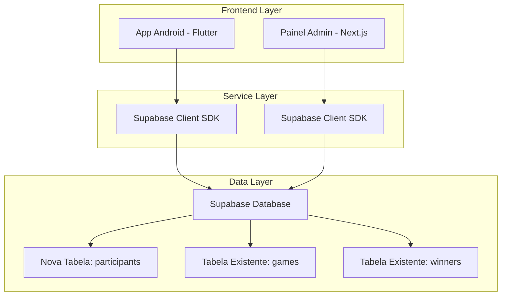
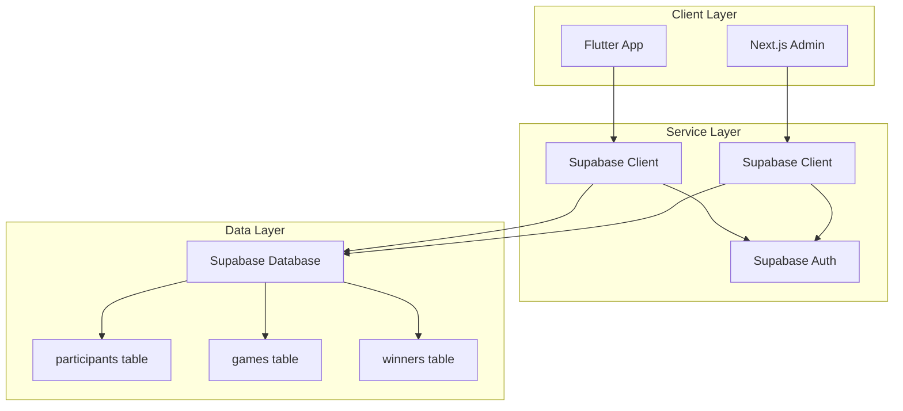
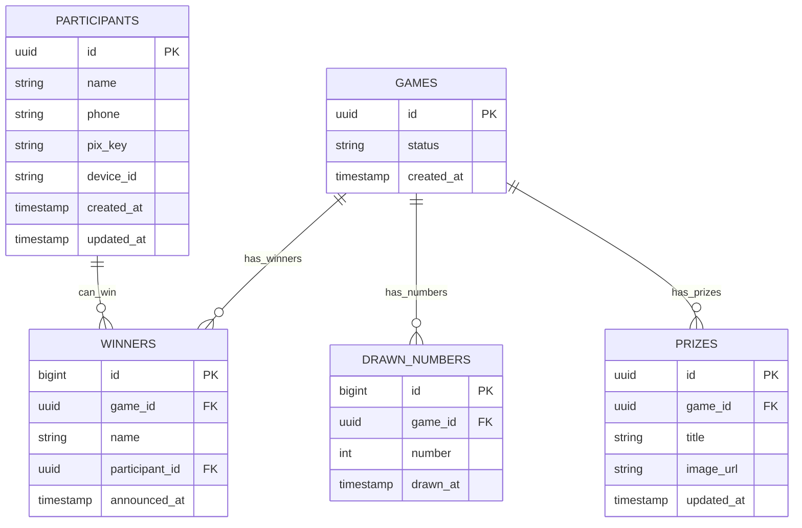

# Arquitetura Técnica - Sistema de Participantes do Bingo

## 1. Architecture design



## 2. Technology Description

* **Frontend Android**: Flutter + Supabase Client SDK + Material Design

* **Frontend Admin**: Next.js + React + Supabase Client SDK + Tailwind CSS

* **Backend**: Supabase (PostgreSQL + Auth + Realtime)

* **Validação**: Flutter form validation + Supabase database constraints

## 3. Route definitions

### 3.1 Rotas Android (Flutter)

| Route           | Purpose                                               |
| --------------- | ----------------------------------------------------- |
| /bingo          | Tela principal do Bingo (com verificação de cadastro) |
| /bingo/register | Tela de cadastro de participante                      |
| /bingo/profile  | Tela de edição de dados do participante               |

### 3.2 Rotas Admin Web (Next.js)

| Route                      | Purpose                               |
| -------------------------- | ------------------------------------- |
| /admin                     | Dashboard principal do admin          |
| /admin/participants        | Lista de todos os participantes       |
| /admin/participants/export | Exportação de dados dos participantes |

## 4. API definitions

### 4.1 Core API - Supabase Operations

**Cadastro de Participante**

```typescript
// Inserir novo participante
supabase
  .from('participants')
  .insert({
    name: string,
    phone: string,
    pix_key: string,
    device_id: string
  })
```

**Buscar Participante**

```typescript
// Verificar se participante existe
supabase
  .from('participants')
  .select('*')
  .eq('device_id', device_id)
  .single()
```

**Listar Participantes (Admin)**

```typescript
// Buscar todos os participantes
supabase
  .from('participants')
  .select(`
    id,
    name,
    phone,
    pix_key,
    created_at,
    updated_at
  `)
  .order('created_at', { ascending: false })
```

**Atualizar Participante**

```typescript
// Atualizar dados do participante
supabase
  .from('participants')
  .update({
    name: string,
    phone: string,
    pix_key: string
  })
  .eq('id', participant_id)
```

### 4.2 Tipos TypeScript

```typescript
interface Participant {
  id: string;
  name: string;
  phone: string;
  pix_key: string;
  device_id: string;
  created_at: string;
  updated_at: string;
}

interface ParticipantForm {
  name: string;
  phone: string;
  pix_key: string;
}

interface ParticipantFilter {
  search?: string;
  date_from?: string;
  date_to?: string;
}
```

## 5. Server architecture diagram



## 6. Data model

### 6.1 Data model definition



### 6.2 Data Definition Language

**Tabela de Participantes (participants)**

```sql
-- Criar tabela de participantes
CREATE TABLE participants (
    id UUID PRIMARY KEY DEFAULT gen_random_uuid(),
    name VARCHAR(100) NOT NULL,
    phone VARCHAR(20) NOT NULL,
    pix_key VARCHAR(255) NOT NULL,
    device_id VARCHAR(255) UNIQUE NOT NULL,
    created_at TIMESTAMP WITH TIME ZONE DEFAULT NOW(),
    updated_at TIMESTAMP WITH TIME ZONE DEFAULT NOW()
);

-- Criar índices para performance
CREATE INDEX idx_participants_device_id ON participants(device_id);
CREATE INDEX idx_participants_phone ON participants(phone);
CREATE INDEX idx_participants_created_at ON participants(created_at DESC);

-- Habilitar RLS (Row Level Security)
ALTER TABLE participants ENABLE ROW LEVEL SECURITY;

-- Política de leitura: todos podem ler (para verificação de cadastro)
CREATE POLICY "read participants" ON participants 
FOR SELECT USING (true);

-- Política de inserção: todos podem inserir (cadastro público)
CREATE POLICY "insert participants" ON participants 
FOR INSERT WITH CHECK (true);

-- Política de atualização: apenas o próprio participante pode atualizar
CREATE POLICY "update own participant" ON participants 
FOR UPDATE USING (device_id = current_setting('app.device_id', true));

-- Política de admin: admins podem fazer tudo
CREATE POLICY "admin manage participants" ON participants 
FOR ALL USING (
    EXISTS(SELECT 1 FROM admin_users au WHERE au.user_id = auth.uid())
);

-- Trigger para atualizar updated_at
CREATE OR REPLACE FUNCTION update_participants_updated_at()
RETURNS TRIGGER AS $$
BEGIN
    NEW.updated_at = NOW();
    RETURN NEW;
END;
$$ LANGUAGE plpgsql;

CREATE TRIGGER participants_updated_at
    BEFORE UPDATE ON participants
    FOR EACH ROW
    EXECUTE FUNCTION update_participants_updated_at();

-- Atualizar tabela winners para incluir participant_id
ALTER TABLE winners 
ADD COLUMN IF NOT EXISTS participant_id UUID REFERENCES participants(id);

-- Adicionar à publicação realtime
ALTER PUBLICATION supabase_realtime ADD TABLE participants;

-- Dados iniciais de exemplo (opcional)
INSERT INTO participants (name, phone, pix_key, device_id) VALUES
('João Silva', '(11) 99999-1234', 'joao@email.com', 'device_001'),
('Maria Santos', '(11) 88888-5678', '123.456.789-00', 'device_002'),
('Pedro Costa', '(21) 77777-9012', '(21) 77777-9012', 'device_003')
ON CONFLICT (device_id) DO NOTHING;
```

## 7. Validações e Constraints

### 7.1 Validações de Banco de Dados

```sql
-- Constraint para validar formato do telefone
ALTER TABLE participants 
ADD CONSTRAINT phone_format_check 
CHECK (phone ~ '^\([0-9]{2}\) [0-9]{4,5}-[0-9]{4}$');

-- Constraint para validar tamanho do nome
ALTER TABLE participants 
ADD CONSTRAINT name_length_check 
CHECK (LENGTH(name) >= 2 AND LENGTH(name) <= 100);

-- Constraint para validar PIX não vazio
ALTER TABLE participants 
ADD CONSTRAINT pix_key_not_empty_check 
CHECK (LENGTH(TRIM(pix_key)) > 0);
```

### 7.2 Validações de Frontend

**Flutter (Android)**

```dart
class ParticipantValidator {
  static String? validateName(String? value) {
    if (value == null || value.trim().isEmpty) {
      return 'Nome é obrigatório';
    }
    if (value.trim().length < 2) {
      return 'Nome deve ter pelo menos 2 caracteres';
    }
    if (value.trim().length > 100) {
      return 'Nome deve ter no máximo 100 caracteres';
    }
    return null;
  }
  
  static String? validatePhone(String? value) {
    if (value == null || value.isEmpty) {
      return 'Telefone é obrigatório';
    }
    final phoneRegex = RegExp(r'^\([0-9]{2}\) [0-9]{4,5}-[0-9]{4}$');
    if (!phoneRegex.hasMatch(value)) {
      return 'Formato inválido. Use: (11) 99999-1234';
    }
    return null;
  }
  
  static String? validatePixKey(String? value) {
    if (value == null || value.trim().isEmpty) {
      return 'Chave PIX é obrigatória';
    }
    return null;
  }
}
```

## 8. Integração com Sistema Existente

### 8.1 Modificações Necessárias

**Arquivo: bingo\_full\_setup.sql**

* Adicionar nova tabela `participants`

* Modificar tabela `winners` para incluir `participant_id`

* Adicionar políticas RLS apropriadas

**Arquivo: bingo\_client\_screen.dart**

* Adicionar verificação de cadastro no `initState()`

* Redirecionar para tela de cadastro se necessário

**Painel Admin Web**

* Adicionar nova rota `/admin/participants`

* Criar componente de lista de participantes

* Implementar filtros e exportação

### 8.2 Fluxo de Integração

1. **Verificação de Cadastro**: Antes de iniciar o jogo, verificar se existe participante com o `device_id`
2. **Cadastro Obrigatório**: Se não existir, redirecionar para tela de cadastro
3. **Salvamento**: Após cadastro, salvar no Supabase e retornar ao jogo
4. **Vitória**: Ao anunciar vencedor, buscar dados do participante para pagamento
5. **Admin**: Visualizar todos os participantes com opções de filtro e exportação

