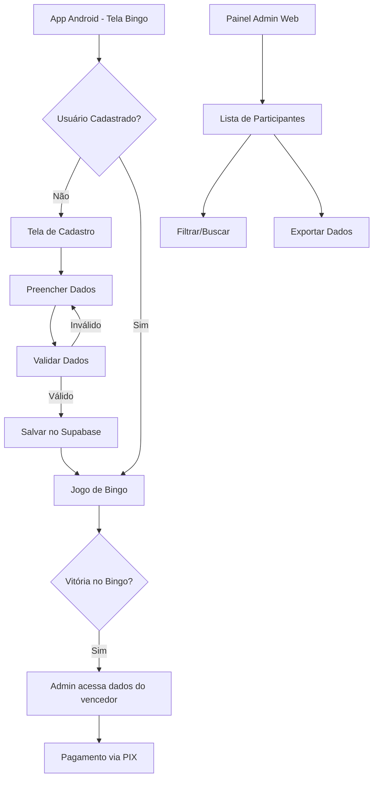

# Sistema de Identificação de Participantes - Bingo

## 1. Product Overview

Sistema de cadastro e identificação de participantes para o jogo de Bingo, permitindo coleta de informações essenciais para pagamento de prêmios e controle administrativo. O sistema integra-se ao app Android existente e ao painel administrativo web, garantindo que todos os jogadores forneçam dados obrigatórios antes de participar.

- **Problema a resolver**: Necessidade de identificar participantes do Bingo para pagamento de prêmios e controle administrativo
- **Usuários**: Jogadores do Bingo (app Android) e Administradores (painel web)
- **Valor do produto**: Facilita o pagamento de prêmios via PIX e oferece controle completo dos participantes aos administradores

## 2. Core Features

### 2.1 User Roles

| Role | Registration Method | Core Permissions |
|------|---------------------|------------------|
| Participante | Cadastro obrigatório no app Android | Pode jogar Bingo após fornecer dados pessoais |
| Administrador | Login existente no painel web | Pode visualizar todos os participantes e gerenciar jogos |

### 2.2 Feature Module

Nosso sistema de participantes consiste nas seguintes páginas principais:

1. **Tela de Cadastro de Participante (Android)**: formulário de dados pessoais, validação de campos obrigatórios, integração com sistema de Bingo.
2. **Lista de Participantes (Painel Admin Web)**: visualização de todos os participantes, filtros e busca, exportação de dados.
3. **Integração com Tela de Bingo**: verificação de cadastro antes do jogo, bloqueio para usuários não cadastrados.

### 2.3 Page Details

| Page Name | Module Name | Feature description |
|-----------|-------------|---------------------|
| Tela de Cadastro de Participante | Formulário de Dados | Coletar nome/apelido, telefone e PIX. Validar campos obrigatórios. Salvar no Supabase. |
| Tela de Cadastro de Participante | Validação | Verificar formato do telefone e PIX. Exibir mensagens de erro. Impedir cadastro incompleto. |
| Tela de Cadastro de Participante | Integração | Redirecionar para tela de Bingo após cadastro. Verificar se usuário já está cadastrado. |
| Lista de Participantes (Admin) | Visualização | Exibir todos os participantes em tabela. Mostrar nome, telefone, PIX e data de cadastro. |
| Lista de Participantes (Admin) | Filtros e Busca | Filtrar por data de cadastro. Buscar por nome ou telefone. Ordenar por diferentes campos. |
| Lista de Participantes (Admin) | Exportação | Exportar lista em CSV/Excel. Incluir todos os dados dos participantes. |
| Tela de Bingo (Android) | Verificação de Cadastro | Verificar se usuário está cadastrado antes de iniciar jogo. Redirecionar para cadastro se necessário. |
| Tela de Bingo (Android) | Bloqueio | Impedir acesso ao jogo sem cadastro completo. Exibir mensagem informativa. |

## 3. Core Process

**Fluxo do Participante:**
1. Usuário abre o app Android e acessa a tela de Bingo
2. Sistema verifica se o usuário já possui cadastro completo
3. Se não cadastrado, redireciona para tela de cadastro obrigatório
4. Usuário preenche nome/apelido, telefone e número do PIX
5. Sistema valida os dados e salva no banco de dados
6. Após cadastro bem-sucedido, usuário é redirecionado para o jogo de Bingo
7. Usuário pode participar normalmente do jogo

**Fluxo do Administrador:**
1. Admin acessa o painel web existente
2. Nova seção "Participantes" é adicionada ao menu
3. Admin visualiza lista completa de todos os participantes cadastrados
4. Admin pode filtrar, buscar e exportar dados dos participantes
5. Em caso de vitória no Bingo, admin tem acesso aos dados para pagamento via PIX

## 4. User Interface Design

### 4.1 Design Style

- **Cores primárias**: Roxo (#9C27B0) e dourado (#FFD700) - mantendo consistência com o design atual do Bingo
- **Cores secundárias**: Verde para sucesso (#4CAF50), vermelho para erros (#F44336)
- **Estilo de botões**: Gradientes com bordas arredondadas (12px), sombras suaves
- **Fontes**: Roboto para Android, tamanhos 16px (corpo), 18px (títulos), 14px (labels)
- **Layout**: Cards com sombras, espaçamento consistente de 16px, design responsivo
- **Ícones**: Material Design Icons, estilo filled para ações principais

### 4.2 Page Design Overview

| Page Name | Module Name | UI Elements |
|-----------|-------------|-------------|
| Tela de Cadastro | Formulário | Card branco com sombra, campos de texto com bordas roxas, labels flutuantes, botão gradiente roxo-dourado |
| Tela de Cadastro | Validação | Mensagens de erro em vermelho abaixo dos campos, ícones de alerta, animações suaves |
| Lista Participantes (Admin) | Tabela | Tabela responsiva com cabeçalhos roxos, linhas alternadas, ícones de ação |
| Lista Participantes (Admin) | Filtros | Barra de busca no topo, filtros dropdown, botões de exportação com ícones |

### 4.3 Responsiveness

O sistema é mobile-first com adaptação para desktop no painel admin. A tela de cadastro no Android é otimizada para touch, com campos grandes e espaçamento adequado. O painel admin web é responsivo com breakpoints para tablet e desktop.

## 5. Validações e Regras de Negócio

### 5.1 Validações de Dados

- **Nome/Apelido**: Mínimo 2 caracteres, máximo 50 caracteres, apenas letras e espaços
- **Telefone**: Formato brasileiro (11) 99999-9999, validação de DDD válido
- **PIX**: Aceitar CPF, telefone, email ou chave aleatória, validação de formato

### 5.2 Regras de Negócio

- Cada dispositivo/usuário pode ter apenas um cadastro ativo
- Cadastro é obrigatório antes de participar de qualquer jogo de Bingo
- Dados podem ser editados pelo usuário a qualquer momento
- Admin pode visualizar mas não editar dados dos participantes
- Histórico de participação é mantido para auditoria

## 6. Integração com Sistema Existente

### 6.1 Pontos de Integração

- **Tela de Bingo**: Verificação de cadastro antes de iniciar jogo
- **Banco de dados**: Nova tabela `participants` integrada ao schema existente
- **Painel Admin**: Nova seção no menu existente
- **Sistema de prêmios**: Acesso aos dados do vencedor para pagamento

### 6.2 Impacto em Funcionalidades Existentes

- Tela de Bingo terá verificação adicional no início
- Painel admin terá nova seção de menu
- Banco de dados terá nova tabela com relacionamentos
- Fluxo de vitória incluirá acesso aos dados do participante