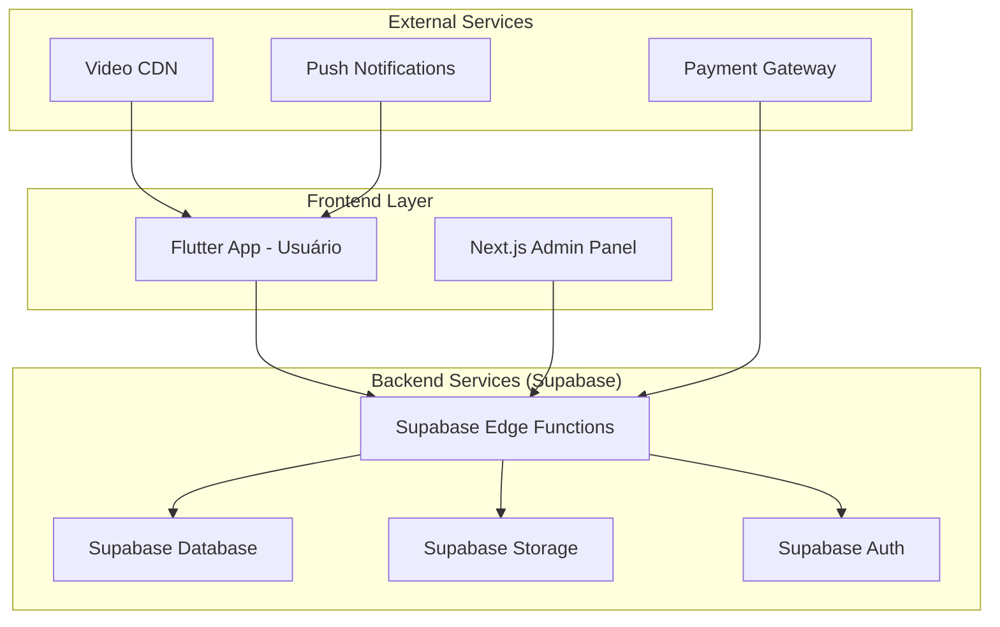
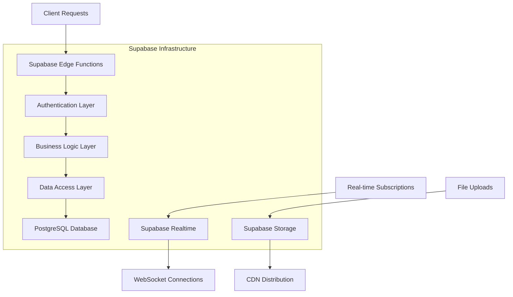
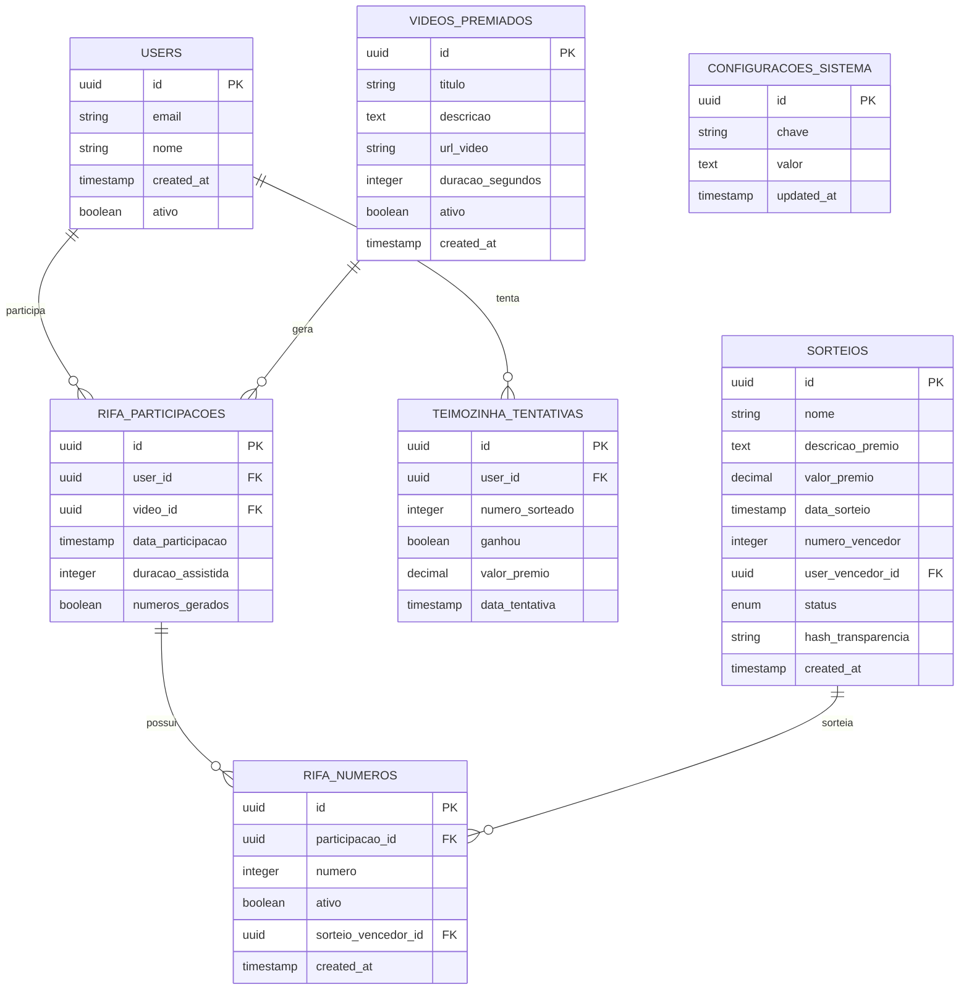

# Sistema de Rifa Digital - Arquitetura Técnica

## 1. Arquitetura do Sistema



## 2. Stack Tecnológico

* **Frontend Mobile:** Flutter 3.16+ com Provider para gerenciamento de estado

* **Frontend Web Admin:** Next.js 14 + TypeScript + Tailwind CSS

* **Backend:** Supabase (PostgreSQL + Edge Functions + Real-time + Storage)

* **Autenticação:** Supabase Auth integrada ao sistema existente

* **Notificações:** Firebase Cloud Messaging

* **Vídeos:** Supabase Storage + CDN para otimização

* **Pagamentos:** Integração com gateway existente do app

## 3. Definições de Rotas

### 3.1 Rotas Mobile (Flutter)

| Rota              | Propósito                                         |
| ----------------- | ------------------------------------------------- |
| /bingo            | Tela principal do bingo com botão "RIFA DA SORTE" |
| /rifa             | Tela principal da rifa com vídeo premiado         |
| /rifa/teimozinha  | Tela do mini sorteio Teimozinha                   |
| /rifa/historico   | Histórico de números e prêmios do usuário         |
| /rifa/sorteio/:id | Tela de acompanhamento de sorteio específico      |

### 3.2 Rotas Admin Web (Next.js)

| Rota                   | Propósito                          |
| ---------------------- | ---------------------------------- |
| /admin/rifa            | Dashboard principal da rifa        |
| /admin/rifa/videos     | Gerenciamento de vídeos premiados  |
| /admin/rifa/sorteios   | Controle de sorteios principais    |
| /admin/rifa/teimozinha | Configurações da Teimozinha        |
| /admin/rifa/premios    | Gerenciamento de prêmios           |
| /admin/rifa/usuarios   | Lista de participantes e histórico |
| /admin/rifa/relatorios | Relatórios e estatísticas          |
| /admin/rifa/auditoria  | Logs e transparência               |

## 4. APIs e Edge Functions

### 4.1 APIs Principais

**Geração de Números da Rifa**

```
POST /api/rifa/gerar-numeros
```

Request:

| Parâmetro       | Tipo    | Obrigatório | Descrição                     |
| --------------- | ------- | ----------- | ----------------------------- |
| user\_id        | UUID    | true        | ID do usuário autenticado     |
| video\_id       | UUID    | true        | ID do vídeo assistido         |
| watch\_duration | integer | true        | Duração assistida em segundos |

Response:

| Parâmetro | Tipo    | Descrição                   |
| --------- | ------- | --------------------------- |
| success   | boolean | Status da operação          |
| numbers   | array   | Array com 3 números gerados |
| rifa\_id  | UUID    | ID da participação na rifa  |

**Sorteio Teimozinha**

```
POST /api/rifa/teimozinha
```

Request:

| Parâmetro | Tipo | Obrigatório | Descrição                 |
| --------- | ---- | ----------- | ------------------------- |
| user\_id  | UUID | true        | ID do usuário autenticado |

Response:

| Parâmetro        | Tipo    | Descrição                     |
| ---------------- | ------- | ----------------------------- |
| success          | boolean | Status da operação            |
| numero\_sorteado | integer | Número sorteado na Teimozinha |
| ganhou           | boolean | Se o usuário ganhou o prêmio  |
| premio\_valor    | decimal | Valor do prêmio (se ganhou)   |

**Criar Sorteio Principal**

```
POST /api/admin/rifa/sorteios
```

Request:

| Parâmetro         | Tipo      | Obrigatório | Descrição                |
| ----------------- | --------- | ----------- | ------------------------ |
| nome              | string    | true        | Nome do sorteio          |
| data\_sorteio     | timestamp | true        | Data e hora do sorteio   |
| premio\_descricao | string    | true        | Descrição do prêmio      |
| premio\_valor     | decimal   | true        | Valor do prêmio          |
| tipo\_sorteio     | enum      | true        | 'automatico' ou 'manual' |

**Executar Sorteio**

```
POST /api/admin/rifa/sorteios/:id/executar
```

Request:

| Parâmetro        | Tipo    | Obrigatório | Descrição                   |
| ---------------- | ------- | ----------- | --------------------------- |
| numero\_vencedor | integer | false       | Número vencedor (se manual) |

Response:

| Parâmetro           | Tipo    | Descrição                 |
| ------------------- | ------- | ------------------------- |
| success             | boolean | Status da operação        |
| numero\_vencedor    | integer | Número sorteado           |
| vencedor            | object  | Dados do usuário vencedor |
| hash\_transparencia | string  | Hash para auditoria       |

## 5. Arquitetura do Servidor



## 6. Modelo de Dados

### 6.1 Diagrama Entidade-Relacionamento



### 6.2 Scripts de Criação das Tabelas

**Tabela de Participações na Rifa**

```sql
-- Criar tabela de participações na rifa
CREATE TABLE rifa_participacoes (
    id UUID PRIMARY KEY DEFAULT gen_random_uuid(),
    user_id UUID REFERENCES auth.users(id) ON DELETE CASCADE,
    video_id UUID REFERENCES videos_premiados(id),
    data_participacao TIMESTAMP WITH TIME ZONE DEFAULT NOW(),
    duracao_assistida INTEGER NOT NULL,
    numeros_gerados BOOLEAN DEFAULT FALSE,
    created_at TIMESTAMP WITH TIME ZONE DEFAULT NOW(),
    updated_at TIMESTAMP WITH TIME ZONE DEFAULT NOW()
);

-- Criar índices
CREATE INDEX idx_rifa_participacoes_user_id ON rifa_participacoes(user_id);
CREATE INDEX idx_rifa_participacoes_data ON rifa_participacoes(data_participacao DESC);

-- Políticas RLS
ALTER TABLE rifa_participacoes ENABLE ROW LEVEL SECURITY;

GRANT SELECT, INSERT ON rifa_participacoes TO authenticated;
GRANT ALL PRIVILEGES ON rifa_participacoes TO service_role;

CREATE POLICY "Usuários podem ver suas próprias participações" ON rifa_participacoes
    FOR SELECT USING (auth.uid() = user_id);

CREATE POLICY "Usuários podem inserir suas participações" ON rifa_participacoes
    FOR INSERT WITH CHECK (auth.uid() = user_id);
```

**Tabela de Números da Rifa**

```sql
-- Criar tabela de números da rifa
CREATE TABLE rifa_numeros (
    id UUID PRIMARY KEY DEFAULT gen_random_uuid(),
    participacao_id UUID REFERENCES rifa_participacoes(id) ON DELETE CASCADE,
    user_id UUID REFERENCES auth.users(id) ON DELETE CASCADE,
    numero INTEGER NOT NULL CHECK (numero >= 1 AND numero <= 1000000),
    ativo BOOLEAN DEFAULT TRUE,
    sorteio_vencedor_id UUID REFERENCES sorteios(id),
    created_at TIMESTAMP WITH TIME ZONE DEFAULT NOW()
);

-- Criar índices
CREATE INDEX idx_rifa_numeros_user_id ON rifa_numeros(user_id);
CREATE INDEX idx_rifa_numeros_numero ON rifa_numeros(numero);
CREATE INDEX idx_rifa_numeros_ativo ON rifa_numeros(ativo) WHERE ativo = TRUE;

-- Políticas RLS
ALTER TABLE rifa_numeros ENABLE ROW LEVEL SECURITY;

GRANT SELECT ON rifa_numeros TO authenticated;
GRANT ALL PRIVILEGES ON rifa_numeros TO service_role;

CREATE POLICY "Usuários podem ver seus próprios números" ON rifa_numeros
    FOR SELECT USING (auth.uid() = user_id);
```

**Tabela de Sorteios**

```sql
-- Criar tabela de sorteios
CREATE TABLE sorteios (
    id UUID PRIMARY KEY DEFAULT gen_random_uuid(),
    nome VARCHAR(255) NOT NULL,
    descricao_premio TEXT NOT NULL,
    valor_premio DECIMAL(10,2) NOT NULL,
    data_sorteio TIMESTAMP WITH TIME ZONE NOT NULL,
    numero_vencedor INTEGER CHECK (numero_vencedor >= 1 AND numero_vencedor <= 1000000),
    user_vencedor_id UUID REFERENCES auth.users(id),
    status VARCHAR(20) DEFAULT 'agendado' CHECK (status IN ('agendado', 'executado', 'cancelado')),
    hash_transparencia VARCHAR(64),
    tipo_sorteio VARCHAR(20) DEFAULT 'automatico' CHECK (tipo_sorteio IN ('automatico', 'manual')),
    created_at TIMESTAMP WITH TIME ZONE DEFAULT NOW(),
    updated_at TIMESTAMP WITH TIME ZONE DEFAULT NOW()
);

-- Criar índices
CREATE INDEX idx_sorteios_data ON sorteios(data_sorteio DESC);
CREATE INDEX idx_sorteios_status ON sorteios(status);
CREATE INDEX idx_sorteios_numero_vencedor ON sorteios(numero_vencedor);

-- Políticas RLS
ALTER TABLE sorteios ENABLE ROW LEVEL SECURITY;

GRANT SELECT ON sorteios TO authenticated;
GRANT ALL PRIVILEGES ON sorteios TO service_role;

CREATE POLICY "Todos podem ver sorteios" ON sorteios
    FOR SELECT USING (true);
```

**Tabela de Tentativas da Teimozinha**

```sql
-- Criar tabela de tentativas da Teimozinha
CREATE TABLE teimozinha_tentativas (
    id UUID PRIMARY KEY DEFAULT gen_random_uuid(),
    user_id UUID REFERENCES auth.users(id) ON DELETE CASCADE,
    numero_sorteado INTEGER NOT NULL CHECK (numero_sorteado >= 1 AND numero_sorteado <= 1000000),
    ganhou BOOLEAN DEFAULT FALSE,
    valor_premio DECIMAL(10,2) DEFAULT 0,
    data_tentativa TIMESTAMP WITH TIME ZONE DEFAULT NOW()
);

-- Criar índices
CREATE INDEX idx_teimozinha_user_id ON teimozinha_tentativas(user_id);
CREATE INDEX idx_teimozinha_data ON teimozinha_tentativas(data_tentativa DESC);
CREATE INDEX idx_teimozinha_ganhou ON teimozinha_tentativas(ganhou) WHERE ganhou = TRUE;

-- Políticas RLS
ALTER TABLE teimozinha_tentativas ENABLE ROW LEVEL SECURITY;

GRANT SELECT, INSERT ON teimozinha_tentativas TO authenticated;
GRANT ALL PRIVILEGES ON teimozinha_tentativas TO service_role;

CREATE POLICY "Usuários podem ver suas tentativas" ON teimozinha_tentativas
    FOR SELECT USING (auth.uid() = user_id);

CREATE POLICY "Usuários podem inserir tentativas" ON teimozinha_tentativas
    FOR INSERT WITH CHECK (auth.uid() = user_id);
```

**Tabela de Vídeos Premiados**

```sql
-- Criar tabela de vídeos premiados
CREATE TABLE videos_premiados (
    id UUID PRIMARY KEY DEFAULT gen_random_uuid(),
    titulo VARCHAR(255) NOT NULL,
    descricao TEXT,
    url_video TEXT NOT NULL,
    duracao_segundos INTEGER NOT NULL,
    ativo BOOLEAN DEFAULT TRUE,
    visualizacoes INTEGER DEFAULT 0,
    created_at TIMESTAMP WITH TIME ZONE DEFAULT NOW(),
    updated_at TIMESTAMP WITH TIME ZONE DEFAULT NOW()
);

-- Criar índices
CREATE INDEX idx_videos_ativo ON videos_premiados(ativo) WHERE ativo = TRUE;
CREATE INDEX idx_videos_created_at ON videos_premiados(created_at DESC);

-- Políticas RLS
ALTER TABLE videos_premiados ENABLE ROW LEVEL SECURITY;

GRANT SELECT ON videos_premiados TO authenticated;
GRANT ALL PRIVILEGES ON videos_premiados TO service_role;

CREATE POLICY "Todos podem ver vídeos ativos" ON videos_premiados
    FOR SELECT USING (ativo = TRUE);
```

**Tabela de Configurações do Sistema**

```sql
-- Criar tabela de configurações
CREATE TABLE configuracoes_sistema (
    id UUID PRIMARY KEY DEFAULT gen_random_uuid(),
    chave VARCHAR(100) UNIQUE NOT NULL,
    valor TEXT NOT NULL,
    descricao TEXT,
    updated_at TIMESTAMP WITH TIME ZONE DEFAULT NOW()
);

-- Inserir configurações padrão
INSERT INTO configuracoes_sistema (chave, valor, descricao) VALUES
('teimozinha_ativa', 'true', 'Se a funcionalidade Teimozinha está ativa'),
('teimozinha_limite_horas', '1', 'Limite de horas entre tentativas da Teimozinha'),
('teimozinha_premio_valor', '100.00', 'Valor do prêmio da Teimozinha em reais'),
('rifa_numeros_por_video', '3', 'Quantidade de números gerados por vídeo assistido'),
('rifa_numero_minimo', '1', 'Número mínimo da rifa'),
('rifa_numero_maximo', '1000000', 'Número máximo da rifa');

-- Políticas RLS
ALTER TABLE configuracoes_sistema ENABLE ROW LEVEL SECURITY;

GRANT SELECT ON configuracoes_sistema TO authenticated;
GRANT ALL PRIVILEGES ON configuracoes_sistema TO service_role;

CREATE POLICY "Todos podem ver configurações" ON configuracoes_sistema
    FOR SELECT USING (true);
```

## 7. Cronograma de Implementação

### Fase 1 - Infraestrutura Base (Semana 1-2)

* ✅ Criação das tabelas no Supabase

* ✅ Configuração das políticas RLS

* ✅ Setup das Edge Functions básicas

* ✅ Integração com sistema de autenticação existente

### Fase 2 - Frontend Mobile (Semana 3-4)

* ✅ Implementação do botão "RIFA DA SORTE" na tela de bingo

* ✅ Desenvolvimento da tela principal da rifa

* ✅ Integração do player de vídeo

* ✅ Sistema de geração de números com animações

### Fase 3 - Sistema Teimozinha (Semana 5)

* ✅ Implementação do mini sorteio

* ✅ Animações e feedback visual/sonoro

* ✅ Sistema de controle de limites

* ✅ Integração com sistema de pagamentos

### Fase 4 - Painel Administrativo (Semana 6-7)

* ✅ Dashboard principal da rifa

* ✅ Gerenciamento de vídeos premiados

* ✅ Sistema de criação e execução de sorteios

* ✅ Configurações da Teimozinha

### Fase 5 - Relatórios e Auditoria (Semana 8)

* ✅ Sistema de logs e auditoria

* ✅ Relatórios estatísticos

* ✅ Certificados de transparência

* ✅ APIs públicas de verificação

### Fase 6 - Testes e Deploy (Semana 9-10)

* ✅ Testes de integração completos

* ✅ Testes de carga e performance

* ✅ Deploy em produção

* ✅ Monitoramento e ajustes finais

