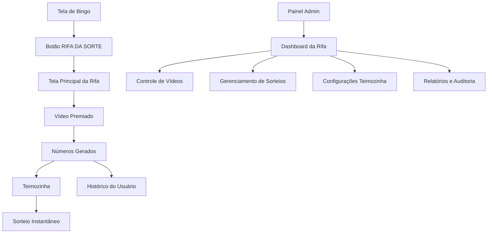

# Sistema de Rifa Digital - Documento de Requisitos do Produto

## 1. Visão Geral do Produto

O Sistema de Rifa Digital é uma extensão completa e profissional do aplicativo de bingo existente, oferecendo aos usuários uma experiência gamificada de participação em rifas através de vídeos premiados e sorteios instantâneos. O sistema integra-se perfeitamente ao painel administrativo atual, proporcionando controle total sobre campanhas, prêmios e transparência nos sorteios.

**Objetivo Principal:** Aumentar o engajamento dos usuários através de um sistema de recompensas baseado em visualização de conteúdo publicitário, gerando receita adicional e fidelização da base de usuários.

**Valor de Mercado:** Sistema inovador que combina marketing digital, gamificação e transparência em sorteios, criando um modelo de negócio sustentável e escalável.

## 2. Funcionalidades Principais

### 2.1 Papéis de Usuário

| Papel | Método de Registro | Permissões Principais |
|-------|-------------------|----------------------|
| Usuário Final | Registro existente do app bingo | Participar de rifas, assistir vídeos, usar Teimozinha, visualizar histórico |
| Administrador | Acesso ao painel web existente | Gerenciar rifas, configurar prêmios, controlar sorteios, visualizar relatórios |
| Super Admin | Credenciais especiais | Todas as permissões + auditoria completa e configurações de segurança |

### 2.2 Módulos Funcionais

O sistema de rifa digital consiste nas seguintes páginas principais:

1. **Tela de Bingo Atualizada**: Botão "RIFA DA SORTE" integrado ao layout existente
2. **Tela Principal da Rifa**: Interface de participação com vídeo premiado e números gerados
3. **Tela Teimozinha**: Mini sorteio instantâneo com animações especiais
4. **Histórico do Usuário**: Visualização de números obtidos e prêmios ganhos
5. **Dashboard Administrativo**: Painel de controle completo para gestão das rifas
6. **Gerenciamento de Sorteios**: Interface para criação e execução de sorteios
7. **Relatórios e Auditoria**: Análises detalhadas e transparência do sistema

### 2.3 Detalhes das Páginas

| Página | Módulo | Descrição da Funcionalidade |
|--------|--------|----------------------------|
| Tela de Bingo | Botão Rifa da Sorte | Adicionar botão fixo "RIFA DA SORTE" com design atrativo, redirecionamento para tela da rifa |
| Tela Principal da Rifa | Player de Vídeo | Reproduzir vídeo premiado obrigatório, validar visualização completa, controles anti-skip |
| Tela Principal da Rifa | Gerador de Números | Gerar 3 números aleatórios (0000001-1000000) após vídeo, animação de revelação, salvar no histórico |
| Tela Principal da Rifa | Botão Teimozinha | Acesso ao mini sorteio, verificar limites de uso, animação de carregamento |
| Tela Teimozinha | Sistema de Sorteio | Sorteio instantâneo, comparação com números do usuário, animação de vitória/derrota, som de feedback |
| Histórico do Usuário | Lista de Números | Exibir todos os números obtidos, status de cada número, prêmios ganhos, filtros por data |
| Dashboard Admin | Estatísticas Gerais | Total de números distribuídos, usuários ativos, taxa de conversão, receita gerada |
| Dashboard Admin | Controle de Vídeos | Upload/link de vídeos, estatísticas de visualização, taxa de conclusão |
| Gerenciamento de Sorteios | Criação de Sorteios | Definir data/hora, tipo de prêmio, número vencedor, modo automático/manual |
| Gerenciamento de Sorteios | Execução de Sorteios | Sorteio ao vivo, validação de transparência, notificação de vencedores |
| Relatórios e Auditoria | Logs do Sistema | Registro de todas as ações, histórico de sorteios, auditoria de números gerados |

## 3. Fluxos Principais do Sistema

### Fluxo do Usuário Final:
1. Usuário acessa tela de bingo → clica em "RIFA DA SORTE"
2. Assiste vídeo premiado completo → recebe 3 números aleatórios
3. Pode usar "Teimozinha" para sorteio instantâneo → ganha R$100 se houver match
4. Visualiza histórico de números e aguarda sorteios principais

### Fluxo do Administrador:
1. Acessa painel web → seção "Rifa da Sorte"
2. Configura vídeos premiados e parâmetros da Teimozinha
3. Cria sorteios principais com datas e prêmios
4. Monitora estatísticas e executa sorteios
5. Gerencia entrega de prêmios e auditoria

## 4. Design da Interface do Usuário

### 4.1 Estilo de Design

- **Cores Primárias:** Roxo (#8B5CF6) e Verde (#10B981) - mantendo consistência com o bingo
- **Cores Secundárias:** Dourado (#F59E0B) para elementos de prêmio, Vermelho (#EF4444) para alertas
- **Estilo dos Botões:** Gradiente 3D com bordas arredondadas, efeitos de hover e animações
- **Tipografia:** Roboto Bold para títulos (24px), Roboto Regular para textos (16px)
- **Layout:** Design card-based com sombras suaves, navegação bottom-tab
- **Ícones:** Material Design com estilo filled, animações Lottie para feedback visual

### 4.2 Visão Geral do Design das Páginas

| Página | Módulo | Elementos de UI |
|--------|--------|-----------------|
| Tela de Bingo | Botão Rifa da Sorte | Botão flutuante dourado com ícone de presente, animação pulsante, posicionamento fixo inferior direito |
| Tela Principal da Rifa | Player de Vídeo | Player fullscreen com controles customizados, barra de progresso dourada, botão skip desabilitado |
| Tela Principal da Rifa | Números Gerados | Cards com números em fonte grande, animação de flip reveal, confetes animados, botão compartilhar |
| Tela Teimozinha | Interface de Sorteio | Roleta animada, botão "SORTEAR" pulsante, contador de tentativas, animação de vitória com som |
| Dashboard Admin | Estatísticas | Cards com métricas, gráficos interativos, filtros por período, exportação de dados |

### 4.3 Responsividade

O sistema é mobile-first com adaptação para tablets. Inclui otimizações para touch, gestos de swipe e feedback háptico para melhor experiência do usuário.

## 5. Segurança e Transparência

### 5.1 Geração Segura de Números
- Algoritmo criptograficamente seguro com seed baseado em timestamp + user_id
- Hash SHA-256 para validação de integridade dos números
- Logs imutáveis de todas as gerações

### 5.2 Auditoria e Compliance
- Registro completo de todas as ações administrativas
- Certificados digitais para sorteios principais
- API pública para verificação de transparência
- Backup automático de dados críticos

### 5.3 Prevenção de Fraudes
- Rate limiting para Teimozinha
- Validação de visualização completa de vídeos
- Detecção de comportamento suspeito
- Blacklist automática para usuários fraudulentos